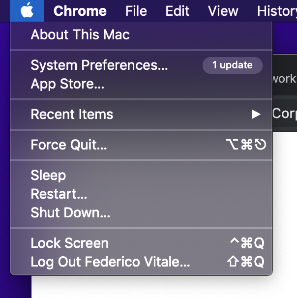

#### Archive the best workflow

I really don’t understand when I see people keep default dock applications without using them and just add new apps to it.

Today I want to give you a shot of my current Mac setup, from Terminal to quick Finder/OS tips.

### The Dock

Here’s the thing: **Dock** and **Spotlight** (or _Alfred_, but we’ll see that later) are your best friends. Having a quick way to access your most used apps and folders in you Mac is fundamental for a good workflow.

I’m used to move my **Dock** on the left side of the screen, that’s because when you have a full screen application, even if you don’t hide it you can fill the all the screen (vertically).

Ok now remove **Preferences** and **The AppStore,** that may sounds weird to you but you don’t need them, you can open these apps from the “_Apple Menu_” in the top left corner of your screen.

