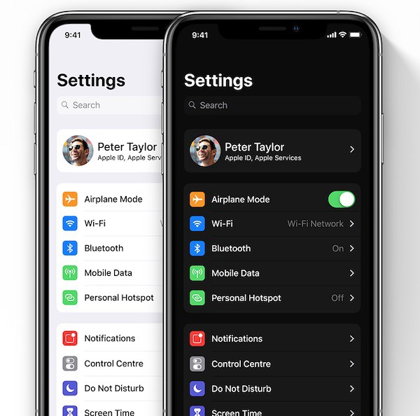
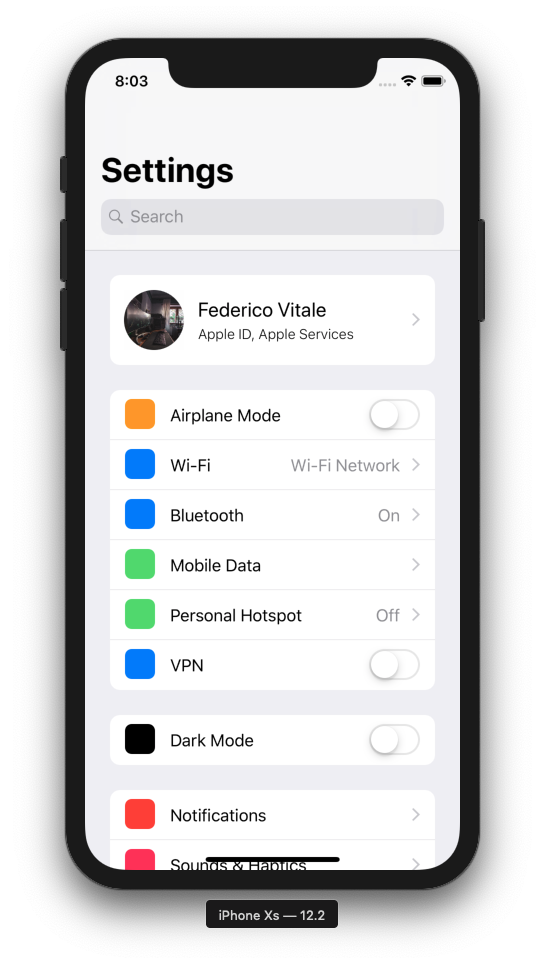

 on [Unsplash](https://unsplash.com?utm_source=medium&utm_medium=referral)](./asset-1)

At the time of this writing, the WWDC 2019 is upcoming and if you search on Google for some leaks/rumors you will encounter this image representing the new Dark Mode in iOS 13. When I’ve just seen this image I thought “wow this cells style would be great for my application”, later on, I’ve realized that this is not possible with a standard `UITableViewCell`. 

So: how can I reproduce this? The answer was easy, using a `collectionView` and placing inside each cell a `tableView`.

### Let’s Code

The concept it’s easy, as said before, you need to create a collectionView and place a tableView inside each cell. 

We’ll start from the tableViewCell and we’ll finish with the collectionViewController.

### Table Cell

What we know:

-   Style: Our cell will be of type `value1` so we can have a detail on the right
-   Height: Choose your own, for this demo I’ll use 50
-   Prop: A custom propriety that contains the data of the current row, such as title, detail and type (toggle or tappable)

The first cell (with the account and apple services) will be a little bit different but we’ll se that later.
