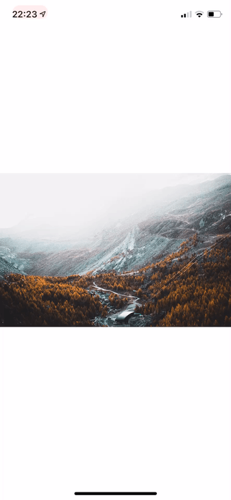

 on [Unsplash](https://unsplash.com?utm_source=medium&utm_medium=referral)](./asset-1)

We find features by accident, right? That’s what happened to me this afternoon.

I’m learning Swift since a quite bunch of time (1/2 months), usually, I like to experiment and try to replicate “big apps/websites” features. That it’s quite easy when you want to replicate something on the web, as a web developer you have the browser dev tools that show you the source code, but what when you want to do the same with an app?

Today I was playing around with GestureRecognizers and I was trying to have the “swipe back gesture” recognized on the half right of the screen when I accidentally dragged away from the screen my \`view\`. Then I realized that it was quite similar to Instagram’s photos zoom gesture.

So I thought that it could have been a great idea to try to replicate it…

Below the boilerplate that we will use to reproduce the pinch/drag effect

<Embed src="https://gist.github.com/Rawnly/a1448698bb16a31d794dce3bd5cd9a16.js" aspectRatio={0.357} caption="" />

As you can see it’s quite simple. Now we need to set up the `UIImageView` that will contain our image. In small projects like this, I usually write a function that setup my component and another helper function to setup constraints:

<Embed src="https://gist.github.com/Rawnly/605bc04dea7959fd4b9931dee05ddb5e.js" aspectRatio={0.357} caption="" />

Now we can get deeper in the core of our `ViewController`

Inside the `viewDidLoad` method, we need to write a bunch of code, first of all, we should implement the `setupImageView` function, after that, we need to write our `GestureRecognizers` that will be of type `pinch` and `pan`.

That’s how our `viewDidLoad` should look like after these changes:

<Embed src="https://gist.github.com/Rawnly/1d15a58020958789ef267f1daadd5072.js" aspectRatio={0.357} caption="" />

Ok, it’s time to implement our functions, `handlePanGesture` and `handlePinchGesture`. We do that in an extension of our `ViewController`, that because we need to extend it as `UIGestureRecognizerDelegate` so we can perform 2 gestures simultaneously thought the `shouldRecognizeSimultaneouslyWith` method.

<Embed src="https://gist.github.com/Rawnly/1c137933b9c606b6596e9150ab96911c.js" aspectRatio={0.357} caption="" />

---

So here we are, our ViewController should now look like this:

<Embed src="https://gist.github.com/Rawnly/c08b3851c410863d168ba80a6be80bb8.js" aspectRatio={0.357} caption="" />

---

Now if you run your app you should can play with the imageView in the center of the screen like you do with Instagram posts.

---

See also: [**Build Your First MacOS App**](https://medium.com/@fede.vitale/build-your-first-macos-app-5d36d3352691)

If you enjoyed what you’ve read, consider check out my [**Github Profile**](https://github.com/rawnly) and [**Instagram**](https://instagram.com/fede.vitale) 😃
